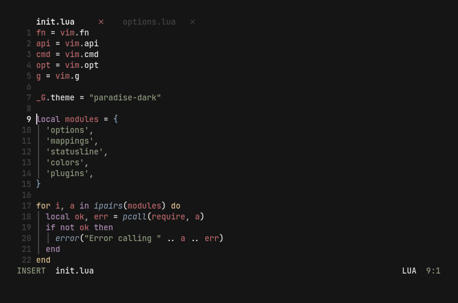
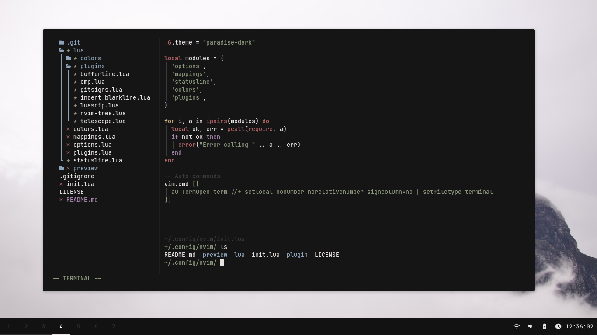
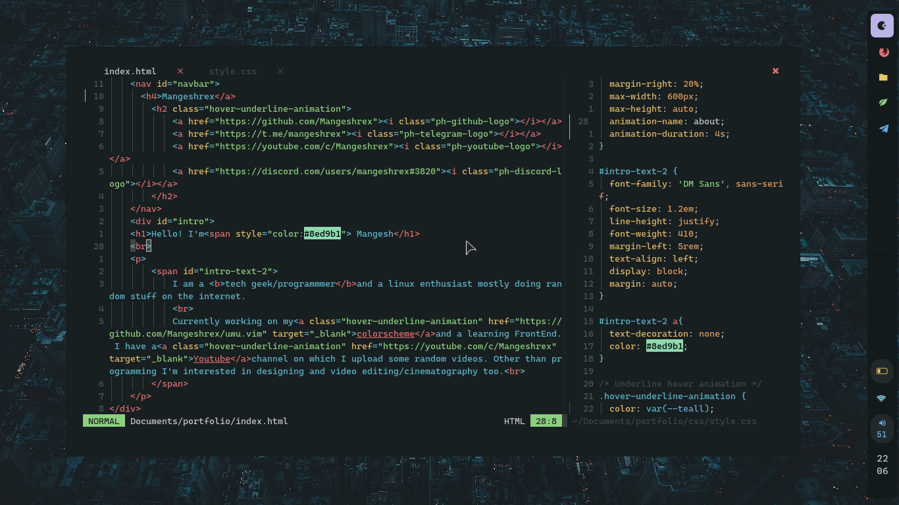
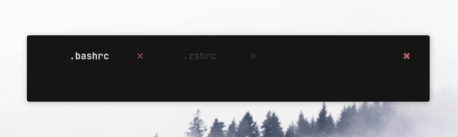
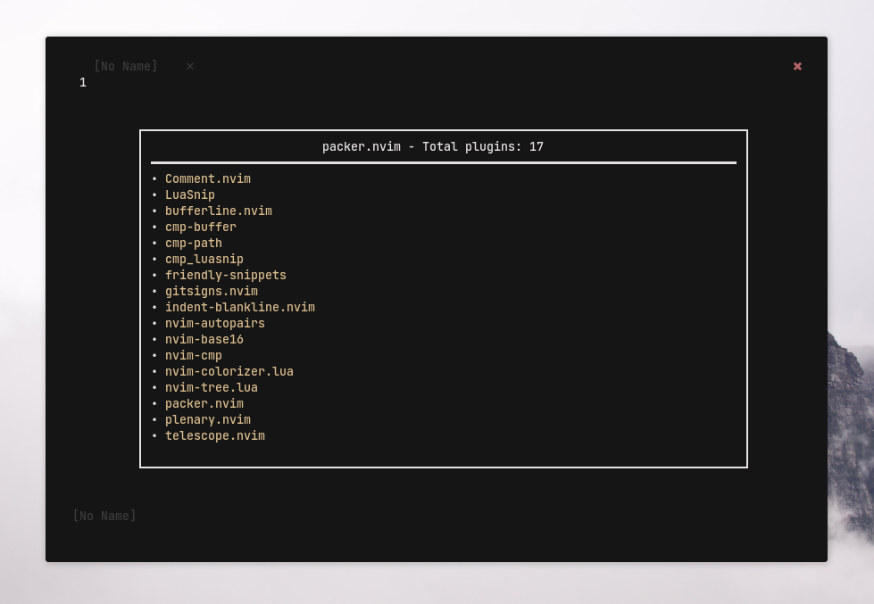
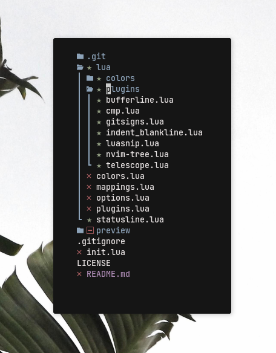
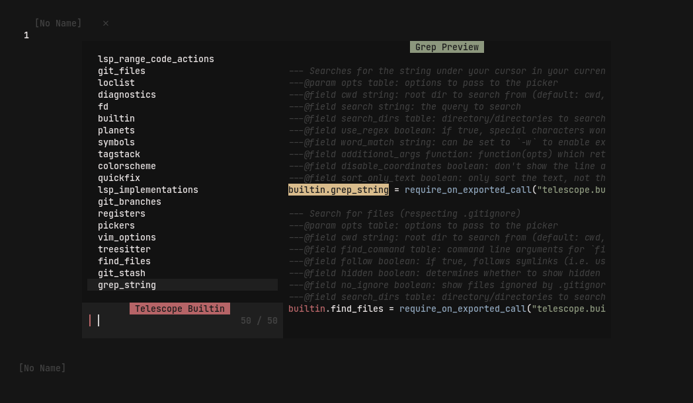

<h1 align="center">Conscious</h1>


<p align="center">
    <a href="https://github.com/Manas140/Conscious/stargazers"></a>
    <a href="https://github.com/Manas140/Conscious/issues"></a>
    <a href="https://github.com/Manas140/Conscious/network/members"></a>
    
</p>

# Features

<details><summary>Showcase</summary>
<p align="center">
  
</p>

- Minimal Mode

<p align="center">
  
</p>

- With <a href="https://github.com/Mangeshrex/everblush.vim">Everblush.vim</a> colorscheme.

<p align="center">
   
</p>
</details>

<details><summary>Plugins</summary>

- Bufferline
<p align="center">
  
</p>

- Packer
<p align="center">
  
</p>

- Nvim-Tree
<p align="center">
  
</p>

- Telescope
<p align="center">
  
</p>
</details>

# Installation
Make a backup of previous config

```sh
[ -d $HOME/.config/nvim ] && mv $HOME/.config/nvim nvim.old
```
Clone the repo

```sh
git clone https://github.com/Manas140/Conscious.git $HOME/.config/nvim
```
Install it

```sh
nvim +:PackerSync
```

# Usage

<details><summary>Mappings</summary>

  |    Keybinds    |                Info               |
  | -----          | -----                             |
  | Tab            | Next Buffer                       |
  | Shift + Tab    | Previous Buffer                   |
  | h + s          | Open a horizontal split           |
  | v + s          | Open a vertical split             |
  | Space + v      | Open a terminal in vertical split |
  | Space + h      | Open a terminal in split          |
  | Space + t      | New tab                           |
  | Space + x      | Close Buffer                      |
  | Control + s    | Write file                        |
  | Space + m      | Toggle minimal mode               |
  | Space + /      | Toggle comment                    |
  | Space + Space  | Open telescope                    |
  | f + f          | Open telescope find_files         |
  | f + b          | Open telescope find_buffer        |
  | Control + n    | Toggle Nvim tree                  |
  | Control + b    | Focus Nvim tree                   |
  | Space + h      | Hard Update                       |

</details>

# Configuration

<details><summary>Mapping</summary>
<br>

> `$HOME/.config/nvim/lua/mappings.lua/`

Add a map which works in `NORMAL` mode

```lua
nmap("<leader>,", ":!echo this is a normal map")
```

Add a map which works in `VISUAL` mode

```lua
vmap("<leader>,", ":!echo this is a visual map")
```
</details>

<details><summary>Colors</summary>
<br>

> `$HOME/.config/nvim/lua/colors/`

- Add a file named `<colorscheme>.lua`

> `$HOME/.config/nvim/lua/colors/<colorscheme>.lua`

- Add colors according to base16 rules

> Example
```lua
return {
  base00 = "#151515",
  base01 = "#1f1f1f",
  base02 = "#282828",
  base03 = "#3b3b3b",
  base04 = "#e8e3e3",
  base05 = "#e8e3e3",
  base06 = "#e8e3e3",
  base07 = "#e8e3e3",
  base08 = "#b66467",
  base09 = "#d9bc8c",
  base0A = "#d9bc8c",
  base0B = "#8c977d",
}
```

> $HOME/.config/nvim/init.lua

- Specify the theme

```lua
_G.theme = "<colorscheme>"
```

</details>

# Special Thanks
- [Mangeshrex](https://github.com/Mangeshrex)
