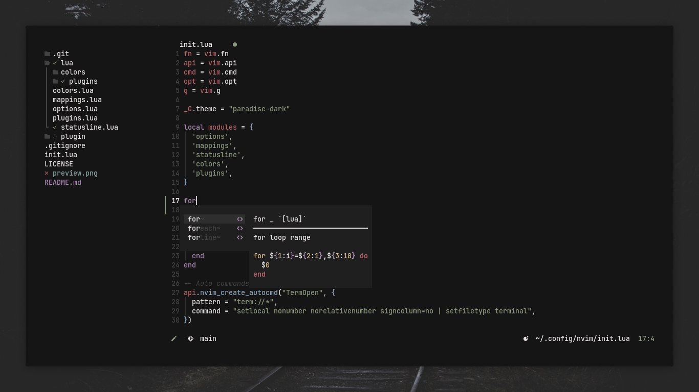

<h1 align="center">Conscious</h1>

<p align="center">
  <a href="https://github.com/Manas140/Conscious/stargazers"></a>
  <a href="https://github.com/Manas140/Conscious/issues"></a>
  <a href="https://github.com/Manas140/Conscious/network/members"></a>
  
</p>

## ShowCase

 

### Plugins

- [autopairs](https://github.com/windwp/nvim-autopairs)
- [bufferline](https://github.com/akinsho/bufferline.nvim)
- [Comment](https://github.com/numToStr/Comment.nvim)
- [friendly-snippets](https://github.com/rafamadriz/friendly-snippets)
- [gitsigns](https://github.com/lewis6991/gitsigns.nvim)
- [indent-blankline](https://github.com/lukas-reineke/indent-blankline.nvim)
- [LuaSnip](https://github.com/L3MON4D3/LuaSnip)
- [nvim-cmp](https://github.com/hrsh7th/nvim-cmp)
- [nvim-colorizer](https://github.com/norcalli/nvim-colorizer.lua)
- [nvim-tree](https://kyazdani42/nvim-tree.lua)
- [telescope](https://github.com/nvim-telescope/telescope.nvim)
- [treesitter](https://github.com/nvim-treesitter/nvim-treesitter)

## Setup
- Make a backup of previous config

```sh
[ -d $HOME/.config/nvim ] && mv $HOME/.config/nvim nvim.old
```
- Clone the repo

```sh
git clone https://github.com/Manas140/Conscious.git $HOME/.config/nvim
```
- Install it

```sh
nvim +PackerSync
```

## Keybinds

  |    Keybinds    |                Info               |
  | -----          | -----                             |
  | Tab            | Next Buffer                       |
  | Shift + Tab    | Previous Buffer                   |
  | h + s          | Open a horizontal split           |
  | v + s          | Open a vertical split             |
  | Space + v      | Open a terminal in vertical split |
  | Space + h      | Open a terminal in split          |
  | Space + t      | New tab                           |
  | Space + x      | Close Buffer                      |
  | Control + s    | Write file                        |
  | Space + m      | Toggle minimal mode               |
  | Space + /      | Toggle comment                    |
  | Space + Space  | Open telescope                    |
  | f + f          | Open telescope find_files         |
  | Control + n    | Toggle Nvim tree                  |
  | Control + b    | Focus Nvim tree                   |
  | Space + h      | Hard Update                       |

## Special Thanks
- [Mangeshrex](https://github.com/Mangeshrex)
